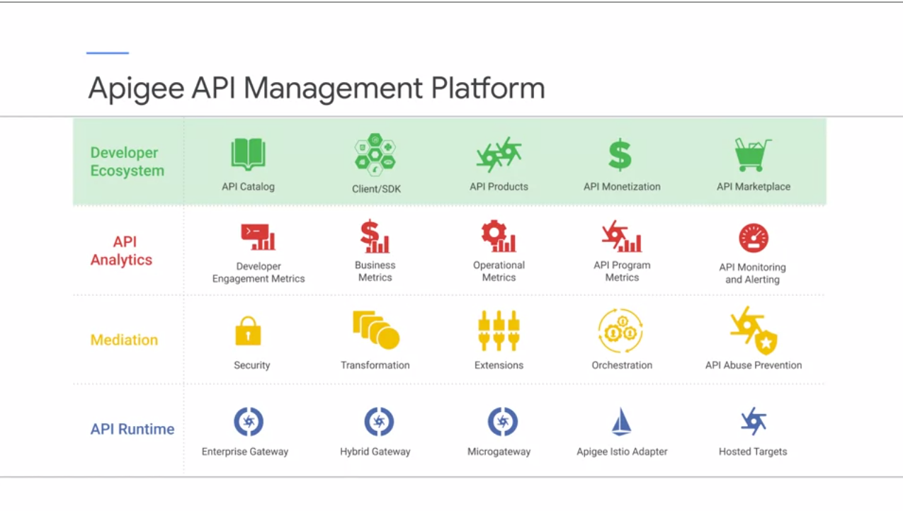
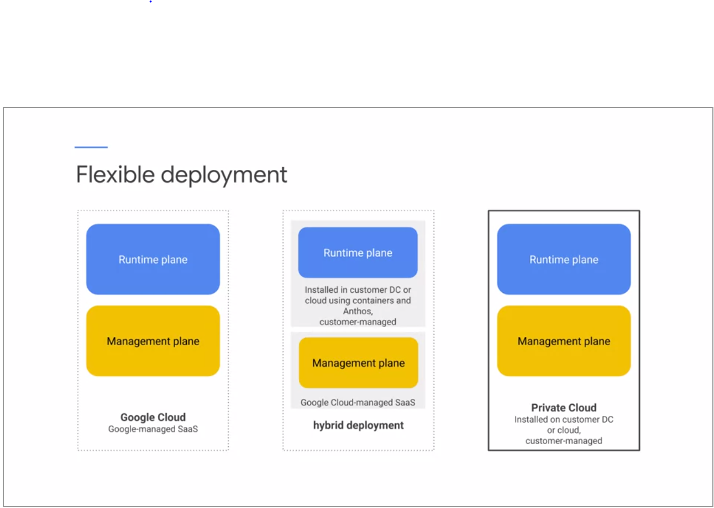
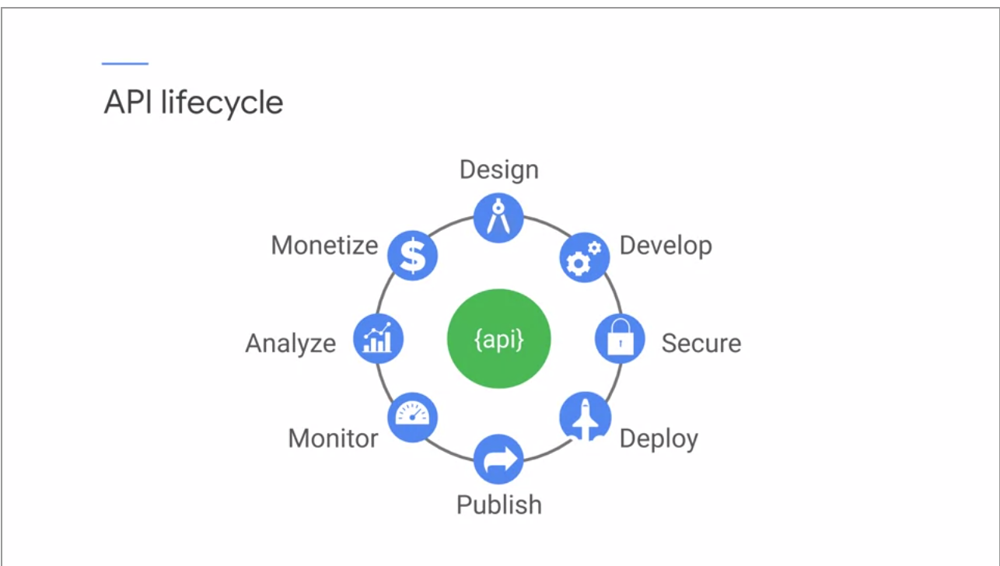

## API Fundamentals

### New challenges (Connected digital experiences)

- Secure
- Scale
- Manage
- Analyze
- Connect

### Apigee API Management platform

### Flex deployment

### API lifecycle

### Open API 3.0 (yaml)

### API Proxy

- Proxy Endpoint
- Target Endpoint

### Multi-tenancy

- Virtual hosts:

  - name
  - alias(es)
  - protocol (http/https)
  - port
  - certificate (if https)

- ProxyEndpoint

  - HttpProxyConnection
    - BasePath
    - VirtualHost (1 or more)

- Condition

- RouteRule

- HTTPTargetConnection
  - LoadBalancer
    - Algorithmn (RoundRobin, LeastConnection ...)
    - Server (1 or more)
    - MaxFailures
  - ### HealthMonitor (if using MaxFailures)

## Dev

- Developers
- Apps
- Products
- API keys

### API Product

- API Product: bundle of APIs
- Control access to APIs
- Use for access or service levels
-

### Status codes

- **200**: 0K
- **400**: Bad Request
- **401**: Unauthorized
- **403**: Forbidden
- **404**: Not found
- **429**: Too Many Requests
- **500**: Internal Server Error

### Other status codes

- **201**: Created
- **204**: No Content
- **304**: Not Modified
- **405**: Method Not Allowed
- **406**: Not Acceptable
- **409**: Conflict
- **503**: Service Unavaiable

### Status code ranges

- **1xx**: Informational
- **2xx**: Success
- **3xx**: Redirection
- **4xx**: Client error
- **5xx**: Server error
