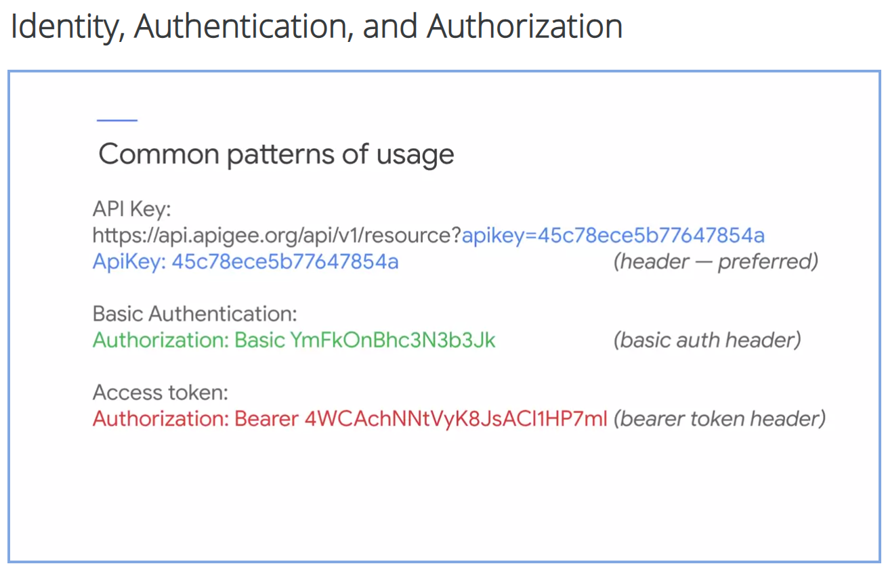

## API Security

### Security concerns

- Public APIs
- Private APIs

### Concerns

- Rate limiting
  - Spike arrest policy
  - Quota policy
- Traffic management: Source IP
  - Access control policy (allows or denies by IP address or IP range)
- Applicataion identity
  - Create or revoke API keys
  - Verify API Key policy
- User authentification and authorization
  - Basic Authentification
  - OAuth 2.0
  - Json Web Tokens and signatures (JWT/JWS)
  - Security Assertion Markup Language (SAML)
  - Can integrate with other security providers
- Data in transit
  - Transport Layer Security (TLS) for all API traffic
- Injection and data-based attacks
  - Regular Expression Protection policy
- Application-level denial of service
  - JSON Threat Protection
  - XML Threat Protection
- Data confidentiality
  - Role-based access control
  - Data masking and private variables
- API security compliance
  - Audit logs
  - API Security Reporting
- Traffic management: Bot detection
  - Apigee Sense

### Identity, Authentification and Authorization

- Identity tracking
  - Tracking usage/access
  - => API Key
- Authentification
  - Validating credentials
  - => App credentials: consumer key & secret
  - => User credentials: username & password
  - => Machine credentials: TLS certificate
  - Credentials must be protected with TLS
  - Standards:
    - AD/LDAP
    - OpenID Connect
- Authorization
  - What is allowed
  - Proof of authentification often via token
  - Standards:
    - OAuth 2.0
    - SAML 2.0



### OAuth

- OAuth: An **authorization framework** that **allows users or clients** to **grant access to server resources** to another entity **without sharing credentials**

- Access Tokens: are **issued to allow limited access** to **specific resources** for a **specified period of time** and **may be revoked byt the user** that granted the permission **or by the server** that issued the token

- Grant types: Authentification scenarios supported by OAuth 2.0

  - Client Credentials

    - Service to Service (No user data involved)
    - For confidential clients
    - **POST /token** -> Apigee Proxy
      - Headers:
        ```json
        {
          "Authorization": "Basic {Base64(client_id:client_secret)}",
          "Content-Type": "x-www-form-urlencoded"
        }
        ```
      - Payload (Form parameters):
        ```json
        {
          "grant_type": "client_credentials",
          "scope": "{scope}"
        }
        ```
    - Response from **POST /token**
      - Returns:
        ```json
        {
          "access_token": "{access_token}",
          "scope": "{scope}",
          "expiry": "{expiry}"
        }
        ```
      - No refresh token
    - **GET /resource** -> Backend
      - Headers:
        ```json
        {
          "Authorization": "Bearer {access_token}"
        }
        ```

  - Resource Owner Password:

    - User data involved
    - For confidential && trusted client
    - Authorization server involved (for validating user credentials)

    - **POST /token** -> Apigee Proxy

      - Headers:
        ```json
        {
          "Authorization": "Basic {Base64(username:password)}",
          "Content-Type": "x-www-form-urlencoded"
        }
        ```
      - Payload (Form parameters):
        ```json
        {
          "grant_type": "password",
          "scope": "{scope}"
        }
        ```
      - **POST /auth** -> Authorization Server
        - Payload:
          ```json
          {
            "username": "{username}",
            "password": "{password}"
          }
          ```
        - Response of **POST /auth**:
          Returns:
          ```json
          {
            "auth_success": "{auth_success}",
            "user_details": "{user_details}"
          }
          ```
      - Response of **POST /token**
        - Returns:
          ```json
          {
            "access_token": "{access_token}",
            "refresh_token": "{refresh_token}",
            "scope": "{scope}",
            "expiry": "{expiry}"
          }
          ```

    - **GET /resource** -> Backend

      - Headers:
        ```json
        {
          "Authorization": "Bearer {access_token}"
        }
        ```

  - Authorization Code:

    - User data involved
    - For trusted || untrusted apps
    - When app developer doesn't want to maintain credentials for
      users
    - Authorization server involved (for validating user credentials)
    - User Agent (browser) involved (for communicating with the Authorization server)

    - **GET /oauth/authorize** -> Apigee Proxy

      - Payload:
        ```json
        {
          "response_type": "code",
          "redirect_uri": "{redirect_uri}",
          "scope": "{scope}",
          "state": "{state}"
        }
        ```
      - Response of **GET /oauth/authorize**
        Returns

        ```f
          login_page?scope={scope}&state={state}&client_id={auth_client_id}
        ```

    - **User authentification in browser**: -> Authorization server

      - User enters credentials in displayed **login_page**
      - User provides consent in **consent_page**

    - **POST /oauth/authcode** -> Apigee proxy (from Authorization server)

      - Payload:
        ```json
        {
          "client_id": "{apigee_client_id}",
          "redirect_uri": "{redirect_uri}",
          "scope": "{scope}",
          "state": "{state}",
          "user_infos": "{user_infos}"
        }
        ```
      - Response of **POST /oauth/authcode**:
        Returns:
        ```f
          302 redirect(redirect_uri?code={code}&state={state}
        ```

    - **POST /token** -> Apigee Proxy

      - Headers:
        ```json
        {
          "Authorization": "Basic {Base64(client_id:client_secret)}",
          "Content-Type": "x-www-form-urlencoded"
        }
        ```
      - Payload (Form parameters):

        ```json
        {
          "grant_type": "authorization_code",
          "code": "{code}",
          "redirect_uri": "{redirect_uri}"
        }
        ```

      - Response of **POST /token**
        - Returns:
          ```json
          {
            "access_token": "{access_token}",
            "refresh_token": "{refresh_token}",
            "scope": "{scope}",
            "expiry": "{expiry}"
          }
          ```

    - **GET /resource** -> Backend

      - Headers:
        ```json
        {
          "Authorization": "Bearer {access_token}"
        }
        ```

  - Authorization Code with PKCE (Proof Key for Code Exchange):

    - User data involved
    - For trusted || untrusted apps
    - When app developer doesn't want to maintain credentials for
      users
    - Authorization server involved (for validating user credentials)
    - User Agent (browser) involved (for communicating with the Authorization server)

    - App generates PKCE

      - `code_verifier` (cryptographically random number)
      - `code_challenge` (base64 urlencoded string of SHA56 hash of code_verifier)
      - code_verifier is stored in session

    - **GET /oauth/authorize** -> Apigee Proxy

      - Payload:
        ```json
        {
          "response_type": "code",
          "client_id": "{client_id}",
          "redirect_uri": "{redirect_uri}",
          "scope": "{scope}",
          "state": "{state}",
          "code_challenge": "{code_challenge}",
          "code_challenge_method": "S256"
        }
        ```
      - Response of **GET /oauth/authorize**
        Returns

        ```f
          login_page?scope={scope}&state={state}&client_id={auth_client_id}
        ```

    - **User authentification in browser**: -> Authorization server

      - User enters credentials in displayed **login_page**
      - User provides consent in **consent_page**

    - **POST /oauth/authcode** -> Apigee proxy (from Authorization server)

      - Payload:
        ```json
        {
          "client_id": "{apigee_client_id}",
          "redirect_uri": "{redirect_uri}",
          "scope": "{scope}",
          "state": "{state}",
          "user_infos": "{user_infos}"
        }
        ```
      - Response of **POST /oauth/authcode**:
        Returns:
        ```f
          302 redirect(redirect_uri?code={code}&state={state}
        ```

    - **POST /token** -> Apigee Proxy

      - Headers: (No client_secret with PKCE so no auth header, add client_id as a form parameter)
        ```json
        {
          "Content-Type": "x-www-form-urlencoded"
        }
        ```
      - Payload (Form parameters):

        ```json
        {
          "grant_type": "authorization_code",
          "code": "{code}",
          "redirect_uri": "{redirect_uri}",
          "client_id": "{client_id}",
          "code_verifier": "{code_verifier}"
        }
        ```

      - Response of **POST /token**
        - Returns:
          ```json
          {
            "access_token": "{access_token}",
            "refresh_token": "{refresh_token}",
            "scope": "{scope}",
            "expiry": "{expiry}"
          }
          ```

    - **GET /resource** -> Backend

      - Headers:
        ```json
        {
          "Authorization": "Bearer {access_token}"
        }
        ```

  - Implicit:
    - Designed for public web & mobile apps
    - Not recommended, use Authorization Code with PKCE instead

- Refresh token:

  - Scope remains the same as for previous access_token
  - **POST /token** -> Apigee Proxy

    - Headers: (no auth header with PKCE)
      ```json
      {
        "Authorization": "Basic {Base64(client_id:client_secret)}",
        "Content-Type": "x-www-form-urlencoded"
      }
      ```
    - Payload (Form parameters):
      add client_id with PKCE

      ```json
      {
        "grant_type": "refresh_token",
        "refresh_token": "{refresh_token}"
      }
      ```

    - Response of **POST /token**
      - Returns:
        ```json
        {
          "access_token": "{access_token}",
          "refresh_token": "{refresh_token}",
          "scope": "{scope}",
          "expiry": "{expiry}"
        }
        ```

  - **GET /resource** -> Backend

    - Headers:
      ```json
      {
        "Authorization": "Bearer {access_token}"
      }
      ```

- Client ids and client secrets: used to identify and authenticate apps

- Generate Basic auth base64 string
  ```bash
    echo -n "username:password" | base64
  ```
- ### Scopes: limit access for a given token
- TLS: All OAuth 2.0 traffic must be sent encrypted via TLS (successor of SSL)

- Types of Apps:
  - Confidential or Public
  - Trusted or Untrusted

### JWT, JWS, SAML, OpenID Connect

- JWT (JSON Web Token)

  - Digitally signed
  - Decoded locally (doesn't need network trip) so valuable for microservices
  - Thus can not be revoked => Keep TTL (Time To Live) fairly short
  - Has 3 sections: `header.payload.signature`

    - Header: algorithm for signing
      - unencoded header:
        ```json
        {
          "alg": "HS256",
          "typ": "JWT"
        }
        ```
    - Payload: claims about the user
      - unencoded payload:
        ```json
        {
          "sub": "18373426",
          "iss": "example.com",
          "aud": "idsvc",
          "iat": 1570819380,
          "exp": 1570819680,
          "name": "John Doe",
          "loacle": "en",
          "email": "john.doe@example.com"
        }
        ```
    - Signature: guaranties integrity of the token
      - signature calculation:
        ```f
          HMACSHA256(
            base64UrlEncoded(header) + "." base64UrlEncoded(payload),
            secret
          )
        ```
    - Policies
      - GenerateJWT
      - VerifyJWT
      - DecodeJWT

- JWS (JSON Web Signature)

  - Can be used to digitally sign any payload
  - A JWS payload can have any format and does not require the payload to be attached to the JWS
  - Signed JWT is a JWS with attached payload containing set of claims in a JSON object
  - Policies
    - GenerateJWS
    - VerifyJWS
    - DecodeJWS

- Federated Identity (IdP)
  - Identity provider
    - stores user profiles
    - responsible for authenticating users
  - Service provider
    - can delegate identity management to trusted IdPs
  - Benefits for user
    - fewer accounts and password to manage
    - SSO (Single sign-on) to multiple apps and services
  - Standards:
    - SAML (Security Assertion Markup Language) (v2 2005)
      - SOAP and XML based protocol
      - uses security tokens called **security assertions**
      - complex protocol, typically **entreprise-oriented**
      - Policies
        - GenerateSAMLAssertion
        - ValidateSAMLAssertion
    - OpenID Connect
      - Lightweight RESTful redesign of SAML (2014)
      - Layers user authentification and identiy on OAuth 2.0
      - Adds **ID token** to OAuth 2.0
        - ID token is secure JWT containing user claims
      - ID tokens can be used to verify the authentification of users and get user details without contacting the issuer
      - Apigee's **JWT** and **OAuthV2** policies can be used to create OIDC providers and consumers

### Content based attacks

- Input validation:

  - Extract fields from payloads using JSONPath/XPath in the **ExtractVariables** policy
  - Validate required fields, field interactions and regular expression pattern by using **proxy conditions** or **Javascript** policies
  - Rewrite validation error messages from the backend

- Malicious input

  - Ex: SQL injection code
  - **RegularExpressionProtection** policy

- Policies

  - **JSONThreatProtection** and **XMLThreatProtection** policies use string-based evaluation of the payload instead of parsing the payload
  - These policies should be run before doing any JSON/XML parsing

- Transport Security

  - TLS (Transport Layer Security)

    - Successor of SSL (Secure Sockets Layer)
    - Establishes encrypted http link between client and server (https)
    - Certificates prove identity
    - TLS handshake: Client encrypt some data with **server's public key** and sends it to Server. Server must be able de decrypt it using **its secret key**
    - One-way TLS (server validation)
      - Standard web https
      - Server presents certificate to prove identity, client does not (**Server Keystore**)
      - Client can validate server certificate (**Server Certificate Truststore**)
    - Two-way TLS (mutual authentification)
      - Best practice for creating secure link from Apigee to backend services
      - Both client and server present certificates (**Server Keystore** and **Client Keystore**)
      - Client and Server each validate each other's certificate (**Server Certificate Truststore** and **Client Certificate Truststore** )
    - KeyStore and TrustStore may be specified by using a name or a reference
    - References must be prefered
      - allows Keystore and Truststore modification without redeployment of proxy/target server and reboot of virtual host
      - also allows key and certificate rotation without downtime

  - Acces Control
    - Allows/Deny list for IPs addresses or ranges
    - AccessControl policy

### Apigee Management Security

- Role-Based Access Control (RBAC)

  - Permissions: create/read/update/delete access to resources
  - Roles: group of permissions that can be assigned to a person
  - Predefined roles
    - Organization administrator (superuser access, including adding users and roles)
    - Read-Only Organization administrator (full readonly access)
    - Operations Administrator (responsible for production)
    - Business User
    - User (API developer)
  - Custom roles can be created for fine grained Access Control

- Data masking and private Variables

  - blocks field being viewed in live trace or trace files
  - Data masking can be configured only by using the Management API (not the Management UI)
  - Can be configured to the Organization level or for a specific proxy
    - Organisation: **POST /v1/o/{org}/maskconfigs**
    - Single Proxy **POST /v1/o{org}/apis/{proxy}/maskconfigs**
    - Body
      ```json
      {
        "logonPassword": "******",
        "lastName": "John",
        "firstName" "Doe"
      }
      ```

- Key Value Maps (KVMs)

  - Storage for non-expiring data retrieved at runtime
  - Keys and Values must both be strings
  - Can be scoped to an Organization, an Environment or a specific Proxy (typically Environment-scoped)
  - Read/Update/Delete KVM entries via
    - Management API
    - Management UI
    - KVM Policy
  - Mark sensitive data as **encrypted** at KVM creation
  - Encrypted values cannot be retrieved by using Management UI or API
  - Can only retrieve values of encrypted KVM by using private variables in a proxy (using **KeyValueMapOperations** policy)

- Private variables
  - private.{varname} is a private variable
